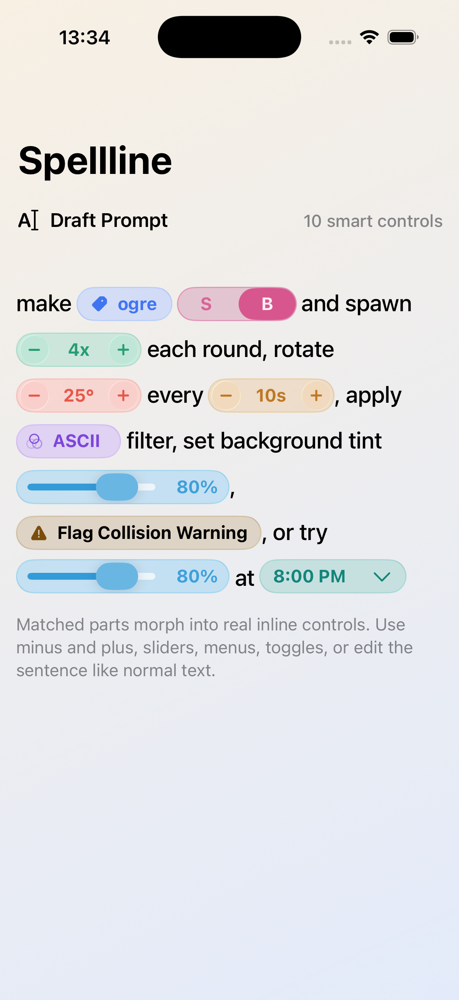

# Spellline

**Spellline** is an iPhone app for drafting prompts: as you type, matching phrases become inline controls—sliders, steppers, menus, toggles, and more—so you can tune a prompt without leaving the sentence.



## Requirements

- Xcode (current release recommended)
- **iOS 26.4** or later (deployment target)

## Run locally

1. Open `Spellline.xcodeproj` in Xcode.
2. Select an iPhone simulator or device.
3. Build and run (**⌘R**).

## GTFS schedule data (ÖBB)

Spellline can use **ÖBB GTFS** schedule data. Download the current **GTFS Fahrplan** ZIP from [ÖBB Open Data — GTFS Soll-Fahrplan](https://data.oebb.at/de/datensaetze~soll-fahrplan-gtfs~): accept the terms on that page, then use **Download**. Extract the archive so the GTFS files (for example `agency.txt`, `routes.txt`, `trips.txt`, …) sit directly under a folder named **`gtfs_data`** at the root of this repository:

```text
Spellline/
  gtfs_data/
    agency.txt
    routes.txt
    …
```

That folder is listed in `.gitignore`, so local GTFS files stay out of git. The dataset is published under [CC BY 4.0](https://creativecommons.org/licenses/by/4.0/) (see the license block on the ÖBB page).

## License

Licensed under the [GNU Affero General Public License v3.0](LICENSE) (AGPL-3.0).  
Copyright © 2026 Florian Ritzmaier.
